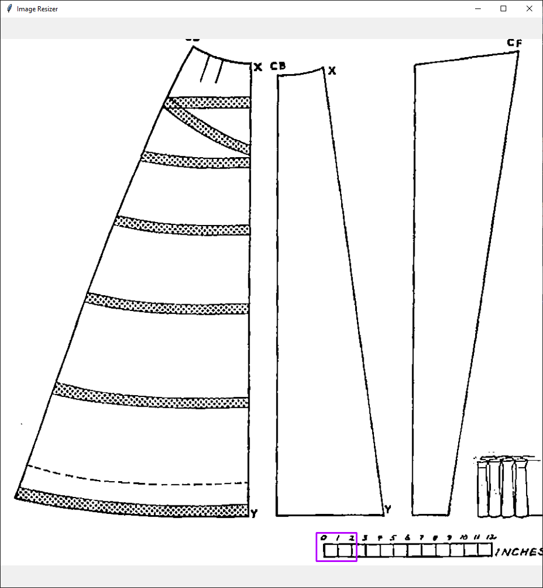
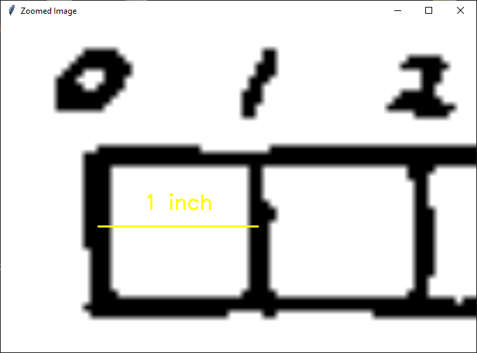
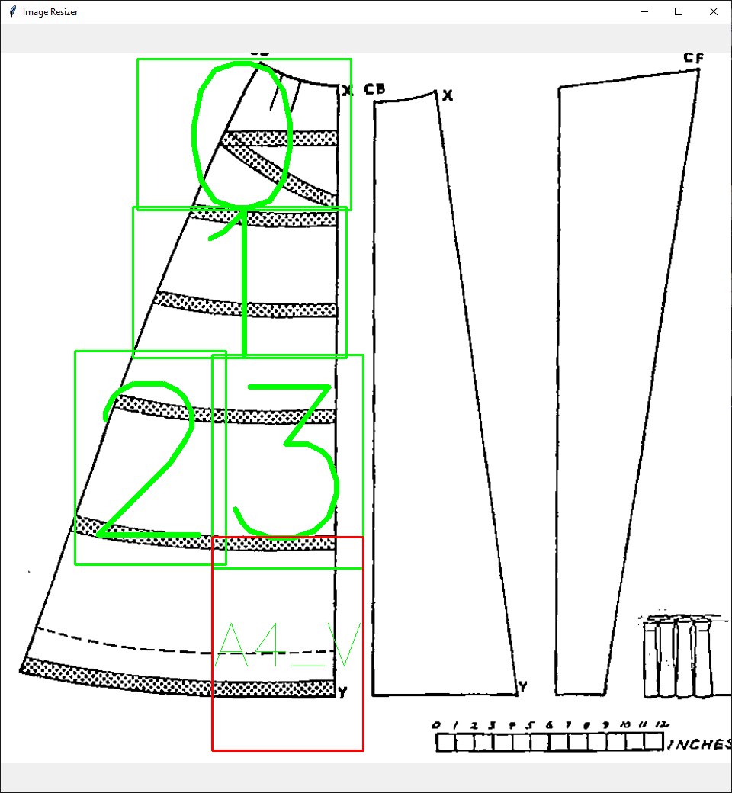
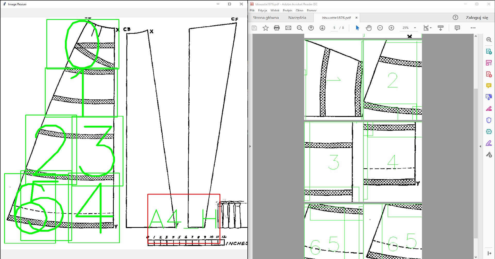

# Image Resizer

"ImageResizer" converts a photo taken eg. by a smartphone into real-size images in one PDF file. The user selects 1 inch in the original image, then indicates the areas of interest. When the user prints that PDF file, the objects’ size on the sheet paper matches the real one.

### Open image

### Select 1 inch

### Indicates the areas of interest

### Export to PDF
